 
## 查看主页获取源码

> **作者介绍**： **✌**全网粉丝10W+本平台特邀作者、博客专家、CSDN新星计划导师、java领域优质创作者,博客之星、掘金/华为云/阿里云/InfoQ等平台优质作者、专注于项目实战 **✌**

  

### 一、作品包含

源码+数据库+全套环境和工具资源+部署教程

### 二、项目技术

前端技术：Html、Css、Js、Layui

数据库：MySQL

后端技术：Java、Spring Boot、MyBatis

  

### 三、运行环境

开发工具：IDEA

数据库：MySQL8.0

数据库管理工具：Navicat10以上版本

环境配置软件： JDK1.8+Maven3.6.3
  

### 四、项目介绍
项目编号：springbootA034

本系统共分为两个角色：管理员和业主。
主要功能有，核心业务处理，基础信息管理，数据统计分析
核心业务处理：车位收费管理，物业收费管理，投诉信息管理，保修信息管理。
基础信息管理：楼宇管理，房屋管理，业主管理，车位管理，抄表管理，用户管理。
数据统计分析：保修统计分析。

### 五、运行截图

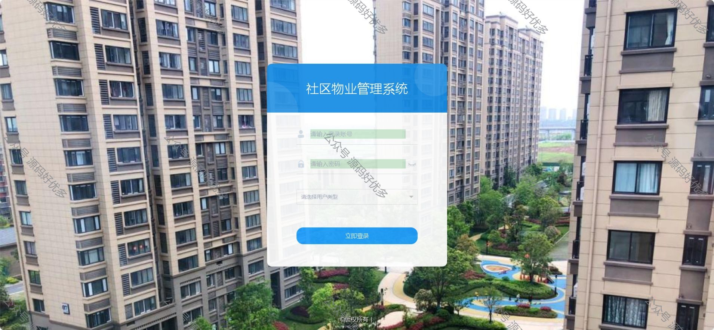
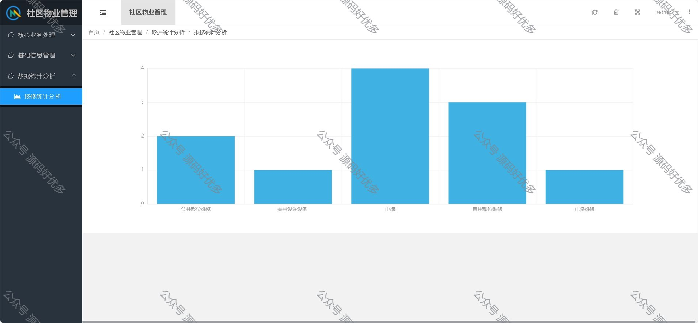
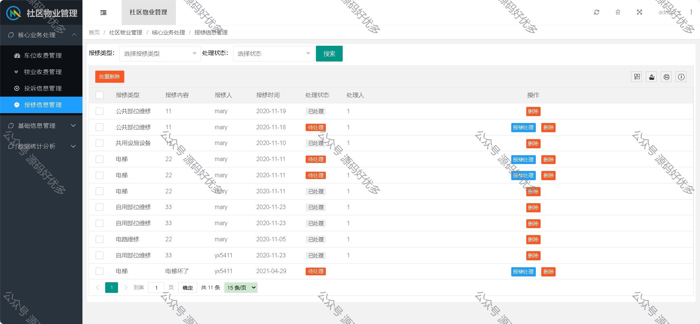
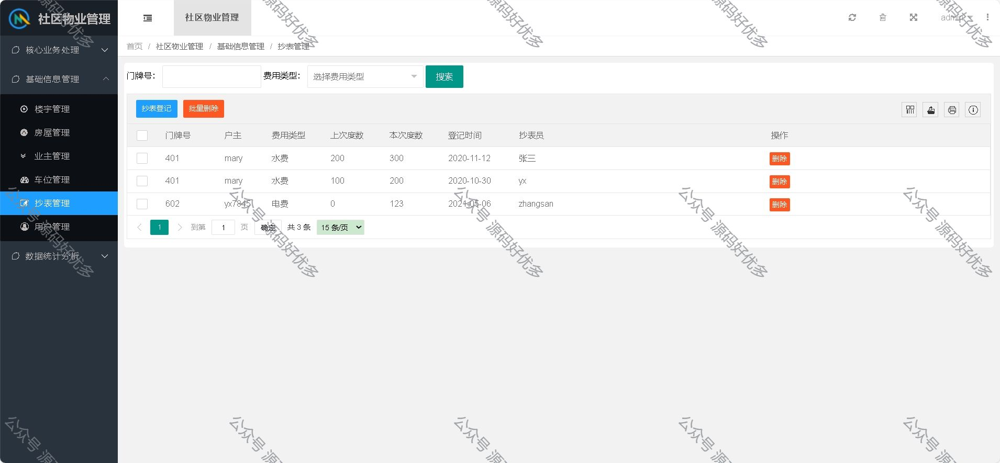
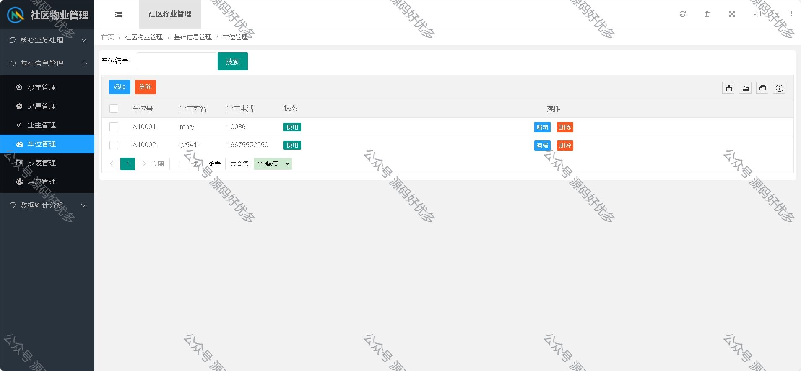
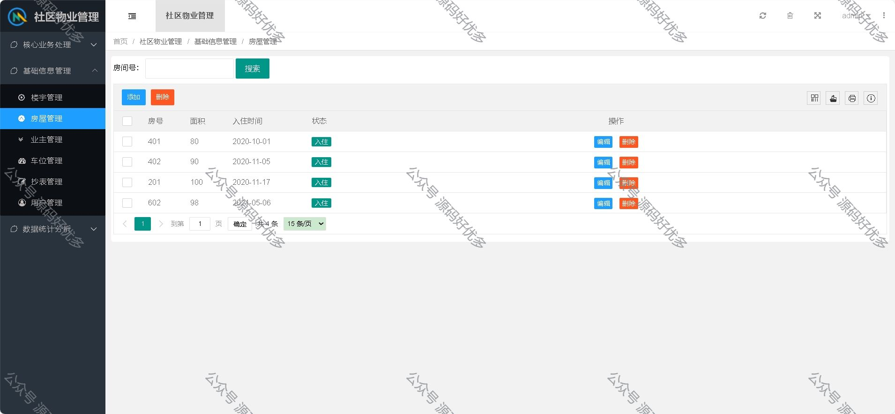
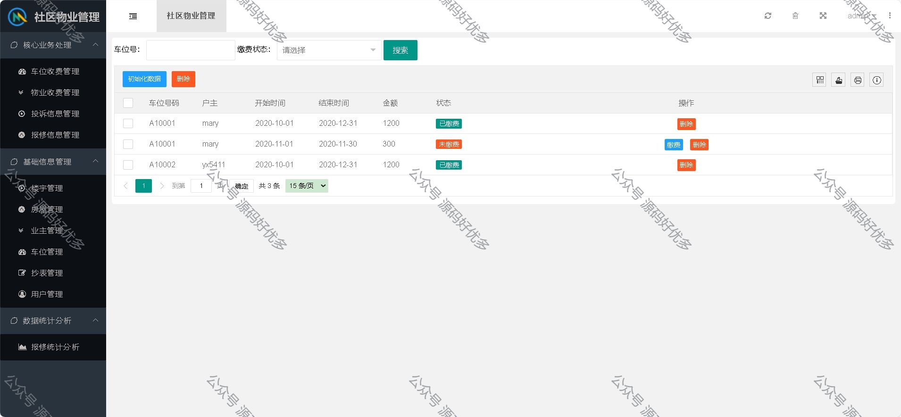
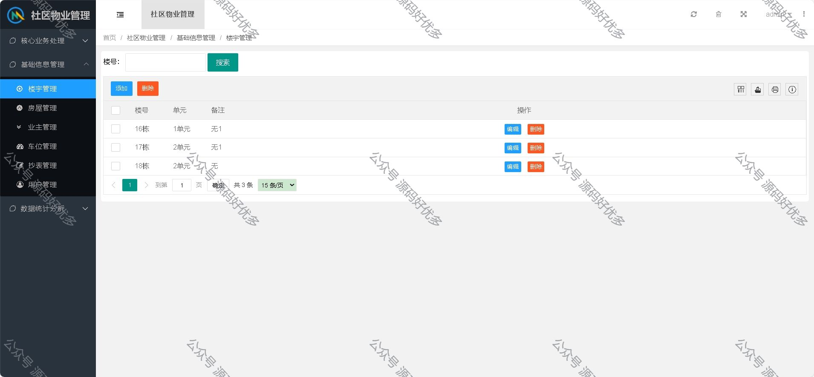
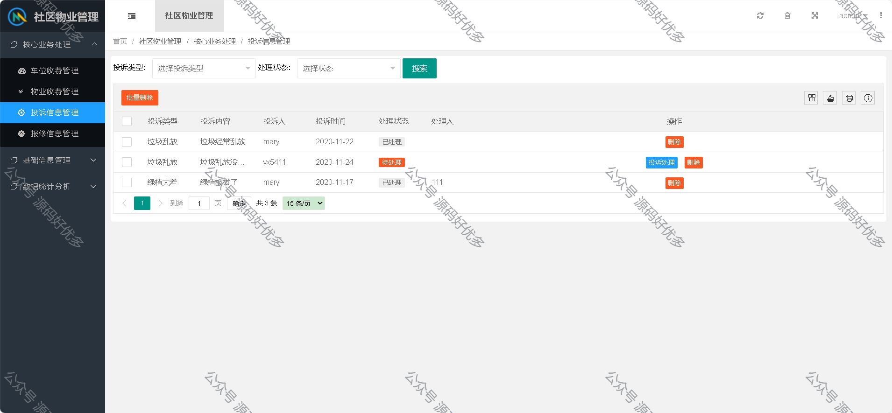
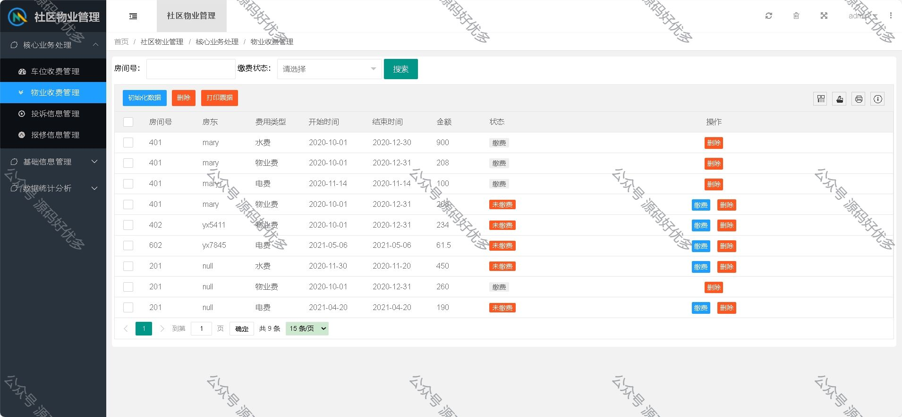
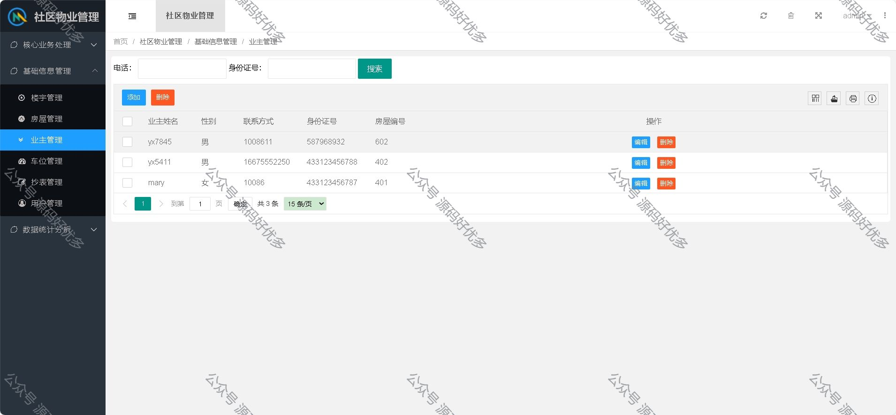
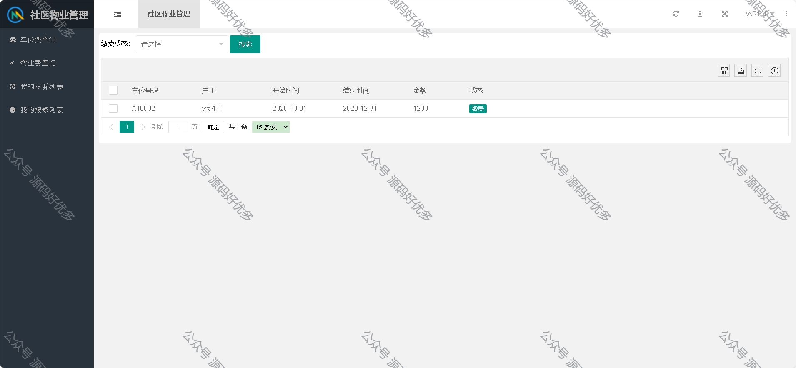
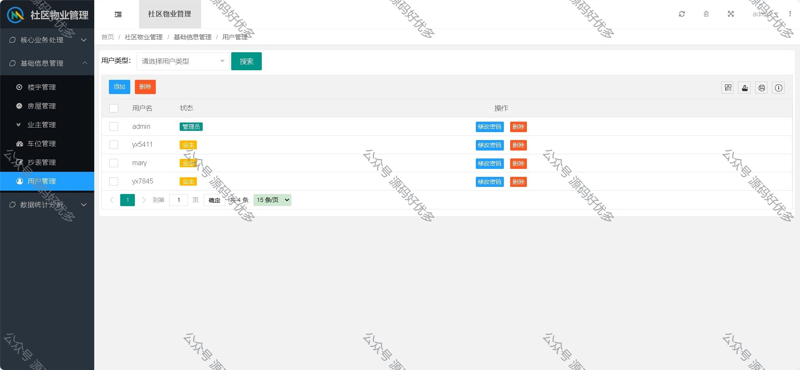
  
